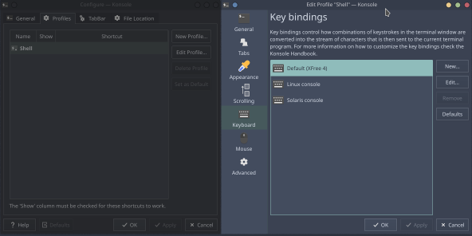
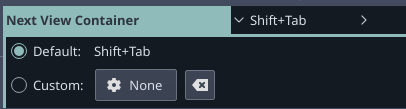

## **1**- Fix Shift + Tab not detected by Konsole / Yakuake

## **2**- Replace Shift + Tab keybinding used by Yakuake (to move between **split** windows)

**Problem 1**: Linux console keybindings don't work correctly in Konsole

**Solution**: Open Konsole, go to Settings -> Manage Profiles -> Edit "Shell (default) -> Keyboard -> Choose Default (XFree 4) -> Click on Defaults -> Click on Ok

Probably will not succeed on the first try, try several times.
To make sure it works, use the command `showkey -a`.

[](https://raw.githubusercontent.com/andreatosti/Dotfiles/KonsoleFixKeybindings/fix_ShiftTabKonsole.png "Fix keybindings")

**Problem 2**: The new versions of Konsole and Yakuake have removed the Next View Container setting, which used SHIFT + TAB as its keybind, so that it could no longer be changed (don't know the reason)

**Solution**: Install a previous version of Konsole and edit the keyboard shorcuts settings from Konsole Settings itself, for example:

```bash
sudo pacman -U https://archive.archlinux.org/packages/k/konsole/konsole-19.04.2-1-x86_64.pkg.tar.xz
```



