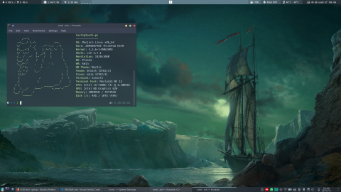

### Polybar

Both scripts and themes were taken from:

* [adi1090x](https://github.com/adi1090x/polybar-themes)
* [polybar scripts](https://github.com/polybar/polybar-scripts)
* [langurmonkey](https://gitlab.com/langurmonkey/dotfiles/blob/master/polybar/scripts/memory.sh)

and then modified:

* by putting a central bar to be used together with KDE Plasma
* I added padding to the texts (quickly, without much care) in order to maintain the fixed size of the modules
* i chose a monospace font for the same reason as the previous point

#### **Note** about display resolution, edit polybar_config:
* **[1920x1080]** `width = 60%`, `offset-x = 20%` (*default*)
* **[1920x1080]** `width = 100%`, `offset-x = 0%` (occupies all the available space)
* **[1600x&nbsp;&nbsp;900]** `width = 68%`, `offset-x = 16%`
* **[1368x&nbsp;&nbsp;768]** `width = 80%`, `offset-x = 10%`
---

### KDE Plasma

#### System Settings -> Appearance

* Look and Feel: [Nordic KDE](https://store.kde.org/p/1327093)
* Workspace Theme -> Plasma Theme + Splash Screen: [Nordic KDE](https://store.kde.org/p/1327093)
* Colours + Application Style -> Window Decorations: [Nordic KDE](https://store.kde.org/p/1327093)
* Icons: [Nordic](https://www.gnome-look.org/dl?file_id=1567965545&file_type=application/x-xz&file_name=Nordic-Folders.tar.xz&file_size=24000&project_id=1267246)
* Wallpaper: [Sailing Ship](https://wallhaven.cc/w/45ope1)

#### Terminal

* Theme: [Nordic konsole](https://store.kde.org/p/1329371)
* Font: [MesloLGS](https://github.com/romkatv/powerlevel10k#recommended-meslo-nerd-font-patched-for-powerlevel10k)
* Shell: [Zsh](http://zsh.sourceforge.net/) + [Oh My Zsh](https://github.com/robbyrussell/oh-my-zsh)
* Shell theme: [Powerlevel10k](https://github.com/romkatv/powerlevel10k)
---

### Boot Manager
#### Refind

##### [Modified ursamajor-rEFInd](https://github.com/hungerys/Dotfiles/tree/master/Refind)

---
#### TODO
* Upload and rearrange all the configurations I'm using

